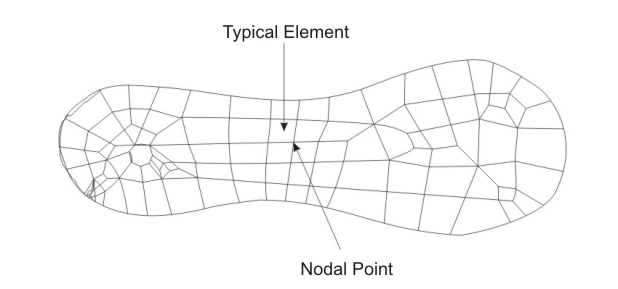
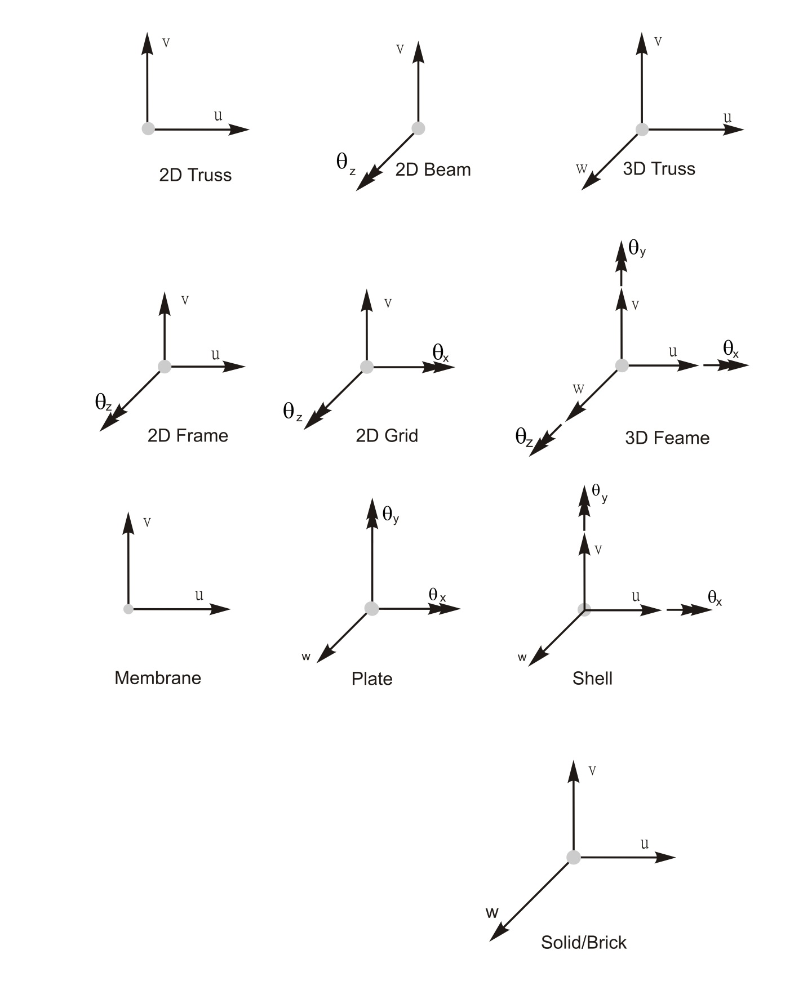

### Introduction

The Finite Element Method (FEM) is a numerical technique to find approximate solutions of partial
differential equations. It was originated from the need of solving complex problems of structural
engineering in Civil, Mechanical and Aerospace engineering. In a structural engineering, it
helps:

- in producing stiffness and strength visualisations
- to minimise material weight and
- to minimise cost of the structures.

FEM allows for detailed visualisation and indicates the distribution of
stresses and strains inside the body of a structure. Many of FE software are powerful yet complex
tool meant for:

### professional engineers with the training and education necessary to properly interpret the results.

Several modern FEM packages include specific components such as

1. Fluid,
2. Thermal,
3. Electromagnetic and
4. Structural

working environments.

FEM allows entire designs to be constructed virtually,
refined and optimised before the design is actually constructed / manufactured.
This powerful design tool has significantly
improved both the standard of engineering designs and the methodology of the design process in
many industrial applications. The use of FEM has significantly decreased the time to take products
from concept to the production line. One must take the advantage of the advent of faster generation
of personal computers for the analysis and design of engineering product with precision level of
accuracy.

### History of FEM

#### Origins in Structural Analysis (1940s–1950s)

- Early Roots: The origins of FEM can be traced back to classical structural analysis methods like
the Direct Stiffness Method and Matrix Structural Analysis used for solving truss, beam, and
frame structures. These methods allowed for more efficient calculations for complex structures.
- Initial Breakthrough: The formal development of FEM began in the 1940s when the need for more
advanced computational methods arose, particularly in the field of aerospace engineering. The
engineers in this field needed methods to analyze the stress and strain of aircraft structures
under various loading conditions.
- The finite element analysis can be traced back to the work by Alexander Hrennikoff (1941)and
Richard Courant(1942). Hrenikoff introduced the framework method, in which a plane elastic
medium was represented as collections of bars and beams.Courant used piecewise polynomial
functions to solve torsion problems, laying the foundation for the method of dividing a problem
into small elements. These pioneers share one essential characteristic: mesh discretisation of a
continuous domain into a set of discrete sub-domains, usually called elements (as of now). 
- John Argyris and Ray Clough (1950s): 
   - In the 1950s, John Argyris and Ray Clough further developed the method by applying it to
   solve structural analysis problems. 
   - Ray Clough, in his 1960 paper, coined the term `Finite Element Method` and demonstrated
   its application to structural engineering problems, specifically in the analysis of plates
   and shells.
- In 1950s, solution of large number of simultaneous equations became possible because of the
digitalcomputer.

#### Growth and Acceptance (1960s–1970s)

- Rapid Development: Throughout the 1960s and 1970s, FEM rapidly evolved, particularly due to advancements
in computer technology. With faster computers, engineers could handle the large-scale matrix operations
required by FEM.
- Civil Engineering Adoption: During this period, civil engineers began to adopt FEM for analyzing and
designing complex structures such as tall buildings, bridges, and dams. It allowed them to model complex
loadings, complex boundary conditions, and complex material behavior that were not possible with classical
methods.
- Commercial Software Development: In the late 1970s, FEM became more accessible to practicing engineers
with the development of commercial software tools like ANSYS and Nastran. These tools provided a
user-friendly interface for applying FEM to practical engineering problems.

#### Modern Era (1980s–Present)

- Computational Power: The availability of powerful computers in the 1980s made it possible to solve
large, three-dimensional FEM problems quickly and accurately. This greatly expanded the method's use
in civil and structural engineering.
- In 1960, Ray W. Clough first published a paper using term “Finite Element Method”.
- In 1965, First conference on “finite elements” was held.
- In 1967, the first book on the “Finite Element Method” was published by Zienkiewicz and Chung.
- In the late 1960s and early 1970s, the FEM was applied to a wide variety of engineering problems.
- In the 1970s, most commercial FEM software packages (ABAQUS, NASTRAN, ANSYS, etc.) originated.
Interactive FE programs on supercomputer lead to rapid growth of CAD systems.
- In the 1980s, algorithm on electromagnetic applications, fluid flow and thermal analysis were
developed with the use of FE program.
- Engineers could evaluate ways to control the vibrations and extend the use of flexible,
deployable structures in space using FE and other methods in the 1990s.
- Trends to solve fully coupled solution of fluid flows with structural interactions, bio-mechanics
related problems with a higher level of accuracy were observed in this decade.
- Advanced Applications: Today, FEM is used not only for static structural analysis but also for
dynamic analysis, seismic analysis, wind engineering, soil-structure interaction, and nonlinear
analysis. The method is used to simulate the behaviour of structures under complex loading conditions,
including earthquakes, wind, and other environmental factors.

With the development of finite element method, together with tremendous increases in computing
power and convenience, today it is possible to understand structural behaviour with levels of
accuracy. This was in fact the beyond of imagination before the computer age.

### Numerical Methods

The formulation for structural analysis is generally based on the three fundamental relations:

- equilibrium,
- constitutive and
- compatibility.

There are two major approaches to the analysis:

- Analytical and
- Numerical.

Analytical approach which leads to closed-form solutions is effective in case of simple geometry,
boundary conditions, loadings and material properties. However, in reality, such simple cases may
not arise. As a result, various numerical methods are evolved for solving such problems which are
complex in nature. For numerical approach, the solutions will be approximate
when any of these relations are only approximately satisfied. The numerical method depends heavily
on the processing power of computers and is more applicable to structures of arbitrary size and
complexity. It is common practice to use approximate solutions of differential equations as the basis
for structural analysis. This is usually done using numerical approximation techniques. Few
numerical methods which are commonly used to solve solid and fluid mechanics problems are given
below.

- Finite Difference Method
- Finite Volume Method
- Finite Element Method
- Boundary Element Method
- Meshless Method

The application of finite difference method for engineering problems involves replacing the
governing differential equations and the boundary condition by suitable algebraic equations. For
example in the analysis of beam bending problem the differential equation is reduced to be solution
of algebraic equations written at every nodal point within the beam member. For example, the beam
equation can be expressed as:

$$\frac{d^4w}{dx^4} = \frac{q}{EI}$$

Each method has noteworthy advantages as well as limitations. However it is possible to
solve various problems by finite element method, even with highly complex geometry and loading
conditions, with the restriction that there is always some numerical errors. Therefore, effective and
reliable use of this method requires a solid understanding of its limitations.

### Concepts of Elements and Nodes

Any continuum/domain can be divided into a number of pieces with very small dimensions. These
small pieces of finite dimension are called `Finite Elements`. A field quantity in each
element is allowed to have a simple spatial variation which can be described by polynomial terms.
Thus the original domain is considered as an assemblage of number of such small elements. These
elements are connected through number of joints which are called `Nodes`. While discretizing the
structural system, it is assumed that the elements are attached to the adjacent elements only at the
nodal points. Each element contains the material and geometrical properties. The material properties
inside an element are assumed to be constant. The elements may be 1D elements, 2D elements or 3D
elements. The physical object can be modeled by choosing appropriate element such as frame
element, plate element, shell element, solid element, etc. All elements are then assembled to obtain
the solution of the entire domain/structure under certain loading conditions. Nodes are assigned at a
certain density throughout the continuum depending on the anticipated stress levels of a particular
domain. Regions which will receive large amounts of stress variation usually have a higher node
density than those which experience little or no stress.

### Degrees of Freedom

A structure can have infinite number of displacements. Approximation with a reasonable level of
accuracy can be achieved by assuming a limited number of displacements. This finite number of
displacements is the number of degrees of freedom of the structure. For example, the truss member
will undergo only axial deformation. Therefore, the degrees of freedom of a truss member with
respect to its own coordinate system will be one at each node. If a two dimension structure is
modeled by truss elements, then the deformation with respect to structural coordinate system will be
two and therefore degrees of freedom will also become two. The degrees of freedom for various
types of element are shown in the figure below for easy understanding. Here ( u , v, w ) and (θ x , θ y , θ z )
represent displacement and rotation respectively.

